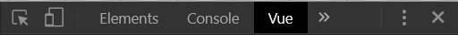

# Vue 筆記

參考教程：
[Vue 出一個電商網站](https://www.udemy.com/vue-hexschool/learn/v4/content)

## 準備

vscode 套件：

[Vue 2 Snippets](https://marketplace.visualstudio.com/items?itemName=hollowtree.vue-snippets)

chrome 外掛

[Vue.js devtools](https://chrome.google.com/webstore/detail/vuejs-devtools/nhdogjmejiglipccpnnnanhbledajbpd)

[vue](https://marketplace.visualstudio.com/items?itemName=liuji-jim.vue)
[Preview on Web Server](https://marketplace.visualstudio.com/items?itemName=yuichinukiyama.vscode-preview-server)

vue中文文檔

https://cn.vuejs.org/

---

## 執行

1. 開啟欲預覽vue的檔案後，點擊右鍵選取vscode-preview-server:Launch on browser

2. 點擊f12，選擇vue

> Vue.js devtools只能在server上運行

---

Github： https://github.com/anita8004/vue-exercise/tree/master